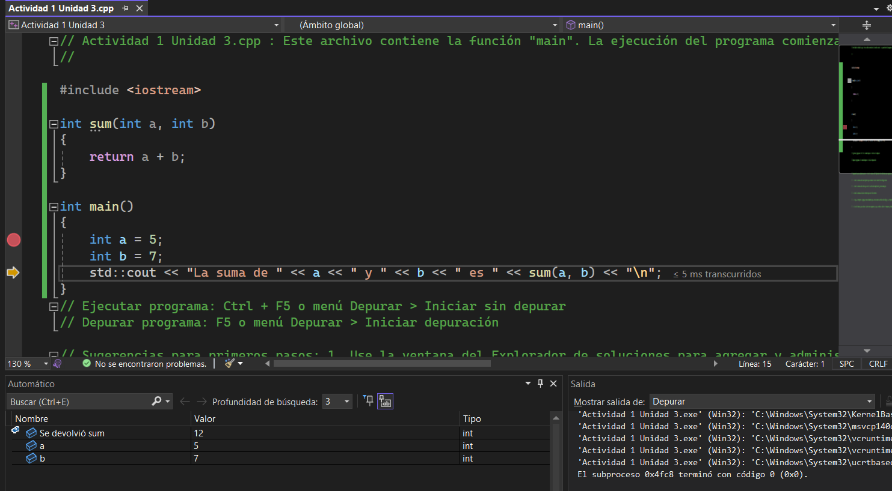

# Explicacion de las acciones de depuracion 

Pausar
* Permite pausar la ejecución del código en cualquier momento durante la depuración.
* Ejemplo: Si tu código entra en un bucle infinito, puedes pausarlo para inspeccionar qué está pasando.

Detener
* Finaliza la ejecución del programa. 
* Ejemplo: Si un error grave ocurre o ya no necesitas seguir depurando, puedes detener el programa.

Reiniciar
* Detiene y vuelve a iniciar la ejecución desde el principio.
* Ejemplo: Si hiciste cambios en el código y quieres probarlos desde cero sin cerrar el depurador.

Continuar / Reanudar (F5)
* Si el código está en pausa en un punto de interrupción, permite continuar la ejecución hasta el siguiente punto de interrupción o hasta el final.

Paso a paso hacia abajo
* Permite ejecutar con los breakpoints el paso a paso

Paso a paso en salto
* Peremite ejecutar con los breakpoint el paso a paso por procedimiento

Paso a paso para salir
* Retrocede el paso a paso 
