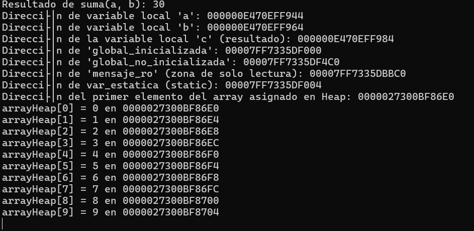

# Mapa Memoria 

+-----------------------------------------------------+
|       Segmento de código (Text Segment)             |
|  Dirección de suma():                               |
|  Dirección de main():                               |
|  Dirección de funcionConStatic():                   |
+-----------------------------------------------------+
|   Segmento de Variables                             |
|  Dirección de global_inicializada: 00007FF7335DF000     |
|  Dirección de mensaje_ro (puntero): 00007FF7335DBBC0     |
|  Dirección de global_no_inicializada: 00007FF7335DF4C0  |
+-----------------------------------------------------+
|                  Heap                               |
|  Dirección del arrayHeap[0]:   0000027300BF86E0     |
|  Dirección del arrayHeap[9]:  0000027300BF8704      |
+-----------------------------------------------------+
|                  Stack                             |
|  Dirección de 'a':  000000E470EFF944               |
|  Dirección de 'b':  000000E470EFF964               |
|  Dirección de 'c':   000000E470EFF984              |
|  Dirección de var_estatica:00007FF7335DF004        |
+-----------------------------------------------------+

