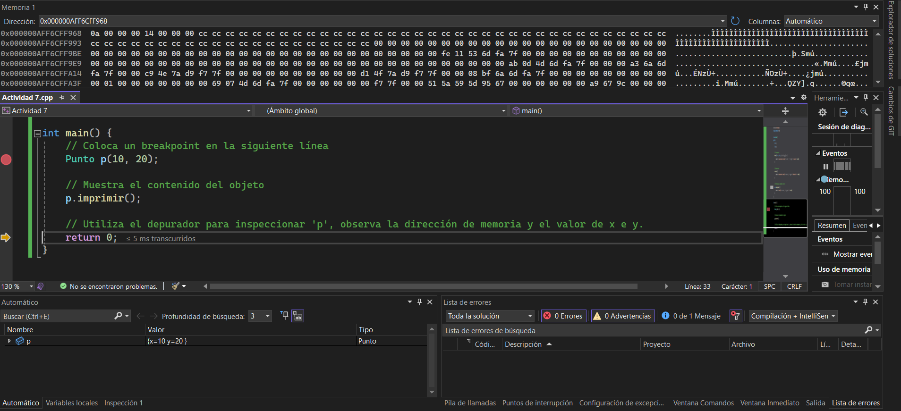

# Actividad 7

¿Cuál es la diferencia entre un constructor y un destructor en C++?
* Constructor: Se ejecuta automáticamente al crear un objeto. Su función es inicializar atributos.
* Destructor: Se ejecuta automáticamente cuando un objeto sale de su ámbito o se libera memoria. Se usa para limpiar recursos.
¿Cuál es la diferencia entre un objeto y una clase en C++?
* Clase: Es un modelo o plantilla que define atributos y métodos.
* Objeto: Es una instancia de una clase en memoria.

¿Qué diferencia notas entre el objeto Punto en C++ y C#?
* En C++, Punto p(10, 20); crea el objeto en el stack y el destructor se ejecuta al salir del ámbito.
* En C#, Punto p = new Punto(10, 20); crea el objeto en el heap, y la memoria es gestionada por el Garbage Collector.

¿Qué es p en C++ y qué es p en C#?
* En C++, p es un objeto real en el stack.
* En C#, p es una referencia a un objeto en el heap.

¿En qué parte de la memoria se almacena p en C++ y en C#?
* C++: p está en el stack.
* C#: p es una referencia en el stack, pero el objeto real está en el heap.

Captura de pantalla del depurador mostrando p y su dirección de memoria

¿Qué observaste con el depurador acerca de p?
* p en C++ tiene una dirección fija en el stack y sus atributos x y y se almacenan contiguamente.
* p en C# es una referencia a un objeto en el heap, y la dirección que almacena p no es la del objeto real.

¿Según lo que observaste, qué es un objeto en C++?
* Un objeto en C++ es una instancia directa de una clase que puede almacenarse en el stack o en el heap, dependiendo de cómo se declare.
* En C#, un objeto es una instancia en el heap y solo se accede a él mediante referencias.
