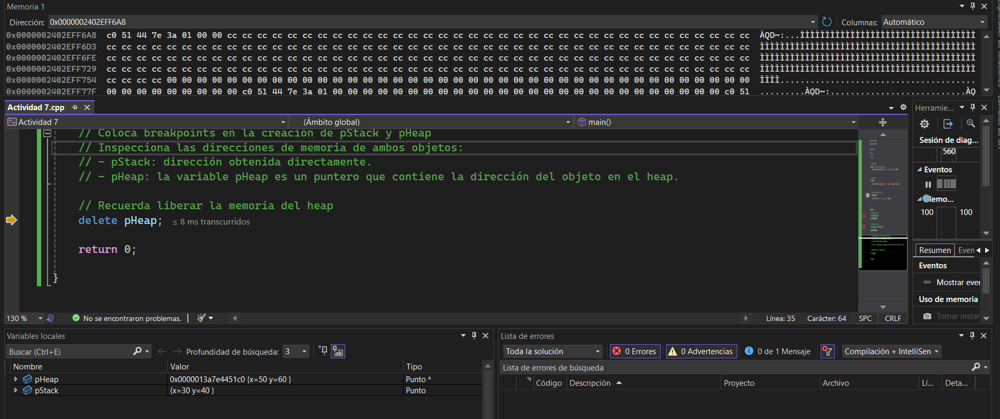

# Actividad 8

## Diferencia entre objetos en el Stack y en el Heap
1. Stack 
* Punto pStack(30, 40);
* Se almacena directamente en la memoria de la pila.
* Se gestiona automáticamente (se destruye al salir del main).
* Rápido y eficiente.

2. Heap 
* Punto* pHeap = new Punto(50, 60);
* Se almacena en la memoria dinámica (heap).
* Necesita ser eliminado manualmente con delete.
* Más flexible, pero más lento.
  
## pStack: ¿Es un objeto o una referencia a un objeto?
Es un objeto.

Se almacena directamente en la pila, no es un puntero ni una referencia.

## pHeap: ¿Es un objeto o una referencia a un objeto?
Es un puntero a un objeto.
Hace referencia a un objeto de tipo Punto que fue creado en el heap.

## Observación en Memory1 y Locals
1. Memory1 (Debug -> Windows -> Memory -> Memory1)
* Se ve la dirección de memoria donde se almacena el puntero pHeap.
  
2. Locals (Debug -> Windows -> Locals)
* Verás pHeap con su dirección y *pHeap con los valores (x = 50, y = 60).

### ¿Qué significa esto?
* pHeap almacena la dirección del objeto en el heap.
* *pHeap accede al objeto al que apunta.
* La dirección en Memory1 te muestra que pHeap es solo un puntero, no el objeto mismo.
