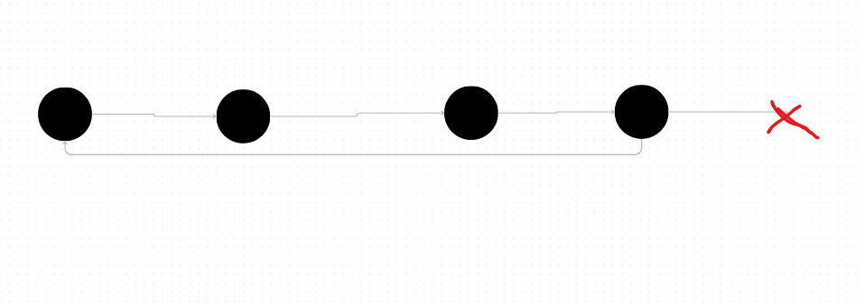

# Actividad 2

## Sin puntero a head:
* No podríamos recorrer la lista fácilmente, ya que head es el punto de inicio.
* Cada vez que quisiéramos acceder a los elementos, tendríamos que almacenar de alguna otra forma la referencia al primer nodo.

## Sin puntero a tail:
* Agregar un nuevo nodo al final sería costoso, ya que tendríamos que recorrer toda la lista para encontrar el último nodo.

## Sin el entero size:
* No podríamos saber directamente cuántos nodos hay en la lista.
* Para conocer el tamaño, tendríamos que recorrer la lista y contar los nodos.

## ¿Por qué se necesario liberar la memoria que ocupa el objeto y además liberar la memoria de los nodos de la lista? ¿Qué pasaría si no lo hicieras?
•  Liberar memoria en C++ es fundamental para evitar fugas de memoria. 
•  LinkedList administra los nodos a través de punteros, por lo que es responsable de limpiarlos. 

## El objeto de la clase LinkedList generalmente contiene:

* head: un puntero al primer nodo.
* tail: un puntero al último nodo (si está implementado).
* size: un contador del número de nodos.

### Cada nodo en la lista tiene:
* Un valor o datos.
* Un puntero al siguiente nodo en la lista.

## ¿Por qué crees que en C++ es necesario liberar la memoria de los objetos?
En C++, en cambio, la administración de memoria es manual, lo que significa que el programador es responsable de asignar (new) y liberar (delete) la memoria cuando sea necesario

## ¿Qué hace el método setup? ¿Qué hace el método update? ¿Qué hace el método draw? ¿Qué hace el método keyPressed?
### setup()
* Inicializa la variable backgroundHue para controlar el color de fondo.
* Crea la serpiente con 20 nodos, todos ubicados en el centro de la pantalla.
### update()
* Si la serpiente está vacía, no hace nada.
* Obtiene la posición del mouse y mueve los nodos de la serpiente suavemente hacia esa posición.
### draw()
* Dibuja un fondo con un degradado de colores.
* Dibuja la serpiente como una línea con colores que cambian a lo largo del cuerpo.
* También dibuja círculos en cada nodo de la serpiente, ajustando su tamaño y color según su posición en la lista.
### keyPressed(int key)
* 'c': Borra toda la serpiente.
* 'a': Agrega un nuevo nodo en una posición aleatoria.
* 'r': Elimina el último nodo de la serpiente.
* 's': Guarda una captura de pantalla.
