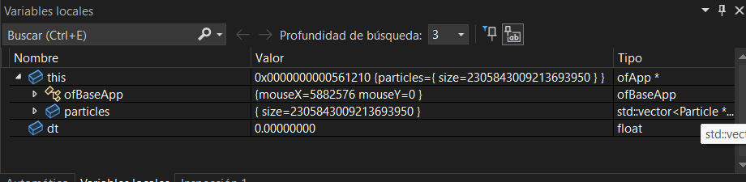
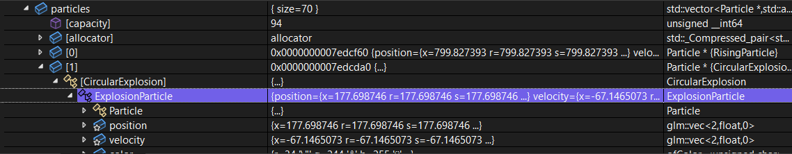
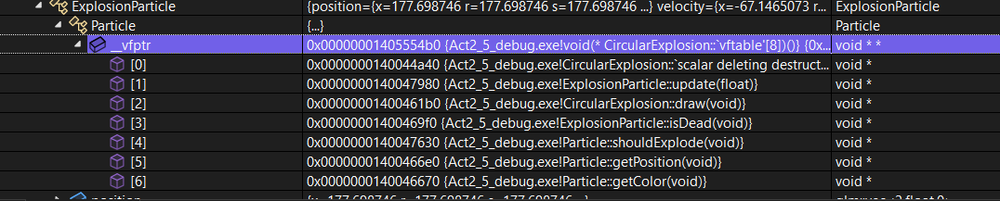
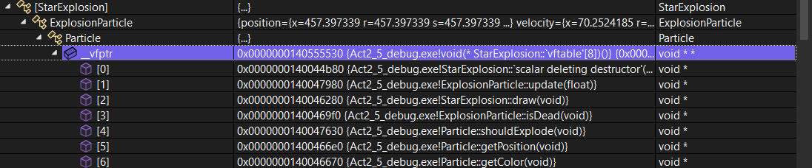
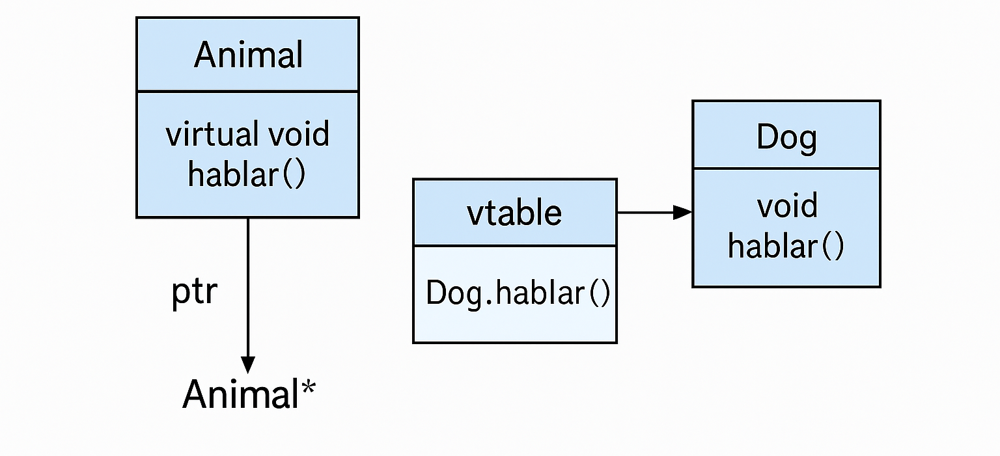

Un vector llamado particles, que contendrá punteros (Particle*) a instancias dinámicas de RisingParticle o de los diferentes tipos de ExplosionParticle.

Mientras el programa esté corriendo, ese vector debería ir creciendo o decreciendo según las explosiones y eliminaciones.

## ¿Qué puedes observar? ¿Qué información te proporciona el depurador? ¿Qué puedes concluir?
En el depurador, se muestra que aunque un puntero apunta a un objeto declarado como tipo base, el depurador muestra el tipo dinámico del objeto y permite verificar que se está ejecutando la versión correcta del método según la clase derivada. 

## ¿Qué puedes observar en la memoria? ¿Qué información te proporciona el depurador? ¿Qué puedes concluir?
En la vista de memoria, se pueden ver los valores binarios que representan los atributos internos del objeto, incluyendo direcciones de memoria, datos de color, posición, etc. También se puede observar la dirección de la vtable (virtual table pointer o vptr).
El depurador permite ver cómo está estructurado un objeto en memoria, incluyendo los atributos heredados desde la clase base y los propios de la clase derivada. Además, se visualiza la dirección que apunta a la tabla virtual (vtable), usada para llamadas dinámicas a métodos.
Demuestra que los atributos se organizan en memoria según la jerarquía de herencia, comenzando por los de la clase base.

## Observa de nuevo ambas tablas y compara. ¿Qué puedes ver? ¿Qué puedes concluir? ¿Qué relación existe entre la tabla de funciones y los métodos virtuales?
Al comparar las tablas, noto que cada tipo de objeto (por ejemplo, RisingParticle, StarExplosion) tiene su propia vtable con direcciones distintas, lo que indica que cada clase sobrescribe métodos de forma diferente.
Cada clase derivada tiene su propia vtable que contiene punteros a las versiones sobrescritas de los métodos virtuales. La relación directa es que los métodos virtuales son los que hacen posible el polimorfismo. 

## ¿Qué relación existe entre los métodos virtuales y el polimorfismo?
Los métodos virtuales son la base del polimorfismo en lenguajes orientados a objetos como C# y C++.

Gracias a ellos, podemos tratar diferentes tipos de objetos como si fueran del mismo tipo base o interfaz, pero ejecutando el comportamiento específico del tipo real.

### ¿Qué sucede?
Suceden unos errores ya que no se pueden acceder a diversos tipos de datos
### ¿Qué puedes concluir?
* El encapsulamiento protege los datos internos de una clase, permitiendo que solo sean accedidos/modificados de manera controlada.
* Esto ayuda a:
  1. Evitar errores involuntarios.
  2. Ocultar detalles internos que no deberían ser visibles desde fuera.
  3. Obligar a usar funciones públicas (getters/setters) si se desea manipular atributos protegidos o privados.

Es como una caja fuerte de datos: lo público está a la vista, lo protegido es accesible solo para "herederos", y lo privado es intocable desde fuera

En C++, el encapsulamiento se aplica en tiempo de compilación. Como secret1 es un campo privado, el compilador prohíbe el acceso directo desde main() o cualquier otra función externa a la clase. 

## ¿Qué pasa al compilar y ejecutar? Y Conclusión del experimento:
El programa compila sin errores y se ejecuta mostrando correctamente los valores de los campos privados
* El compilador sí impide acceder a campos privados por medios normales.
* Sin embargo, en tiempo de ejecución podemos acceder a esos campos usando punteros y reinterpret_cast.
* Esto demuestra que el encapsulamiento en C++ es una regla de tiempo de compilación, no una protección de memoria estricta.

## ¿Qué es el encapsulamiento?

El encapsulamiento es un principio de la programación orientada a objetos que oculta los detalles internos de una clase, exponiendo solo lo que el usuario necesita a través de una interfaz pública.
Esto se logra con modificadores de acceso como private, protected y public.

## ¿Cómo se implementa la herencia en C++?
La herencia en C++ se implementa como una relación entre clases donde una clase hija (derivada) hereda atributos y métodos de una clase padre (base). 

## ¿Qué relación existe entre los métodos virtuales y el polimorfismo?
Los métodos virtuales habilitan el polimorfismo en C++, permitiendo que un mismo código ejecute distintas versiones de una función, dependiendo del tipo real del objeto.

