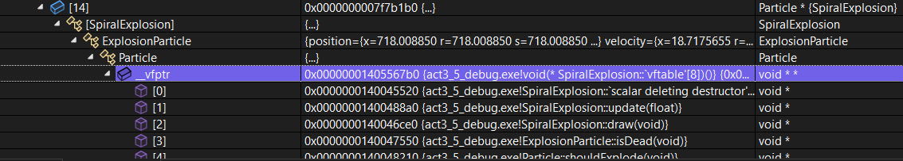

# ACTIVIDAD 3:
## ofApp.cpp
``` c++
#include "ofApp.h"

// --------------------------------------------------------------
void ofApp::setup() {
    ofSetFrameRate(60);
    ofBackground(0);
}

// --------------------------------------------------------------
void ofApp::update() {
    float dt = ofGetLastFrameTime();

    // Actualiza todas las partículas
    for (int i = 0; i < particles.size(); i++) {
        particles[i]->update(dt);
    }

    // Procesa las partículas (iteración en reversa para facilitar eliminación)
    for (int i = particles.size() - 1; i >= 0; i--) {
        // Si la partícula debe explotar, generamos nuevas explosiones
        if (particles[i]->shouldExplode()) {
            int explosionType = (int)ofRandom(4); // 0: Circular, 1: Random, 2: Star, 3: Spiral
            int numParticles = (int)ofRandom(20, 30);
            for (int j = 0; j < numParticles; j++) {
                if (explosionType == 0) {
                    particles.push_back(new CircularExplosion(particles[i]->getPosition(), particles[i]->getColor()));
                }
                else if (explosionType == 1) {
                    particles.push_back(new RandomExplosion(particles[i]->getPosition(), particles[i]->getColor()));
                }
                else if (explosionType == 2) {
                    particles.push_back(new StarExplosion(particles[i]->getPosition(), particles[i]->getColor()));
                }
                else {
                    particles.push_back(new SpiralExplosion(particles[i]->getPosition(), particles[i]->getColor()));
                }
            }
            delete particles[i];
            particles.erase(particles.begin() + i);
        }
        else if (particles[i]->isDead()) {
            delete particles[i];
            particles.erase(particles.begin() + i);
        }
    }
}

// --------------------------------------------------------------
void ofApp::draw() {
    for (int i = 0; i < particles.size(); i++) {
        particles[i]->draw();
    }
}

// --------------------------------------------------------------
void ofApp::createRisingParticle() {
    float minX = ofGetWidth() * 0.35;
    float maxX = ofGetWidth() * 0.65;
    float spawnX = ofRandom(minX, maxX);
    glm::vec2 pos(spawnX, ofGetHeight());
    glm::vec2 target(ofGetWidth() / 2 + ofRandom(-300, 300), ofGetHeight() * 0.10 + ofRandom(-30, 30));
    glm::vec2 direction = glm::normalize(target - pos);
    glm::vec2 vel = direction * ofRandom(250, 350);
    ofColor col;
    col.setHsb(ofRandom(255), 220, 255);
    float lifetime = ofRandom(1.5, 3.5);
    particles.push_back(new RisingParticle(pos, vel, col, lifetime));
}

void ofApp::createFallingParticle() {
    float spawnX = ofRandom(0, ofGetWidth());
    glm::vec2 pos(spawnX, 0);  // Nace en la parte superior
    glm::vec2 vel(0, ofRandom(150, 300));  // Caída vertical
    ofColor col;
    col.setHsb(ofRandom(255), 220, 255);
    float lifetime = ofRandom(1.5, 3.5);
    particles.push_back(new FallingParticle(pos, vel, col, lifetime));
}

void ofApp::createHorizontalParticle() {
    float spawnY = ofRandom(0, ofGetHeight());
    glm::vec2 pos(0, spawnY);  // Nace en el lado izquierdo
    glm::vec2 vel(ofRandom(150, 300), 0);  // Movimiento horizontal
    ofColor col;
    col.setHsb(ofRandom(255), 220, 255);
    float lifetime = ofRandom(1.5, 3.5);
    particles.push_back(new HorizontalParticle(pos, vel, col, lifetime));
}

// --------------------------------------------------------------
void ofApp::mousePressed(int x, int y, int button) {
    createRisingParticle();
}

// --------------------------------------------------------------
void ofApp::keyPressed(int key) {
    if (key == ' ') {
        for (int i = 0; i < 1000; i++) {
            createRisingParticle();
        }
    }
    if (key == 'f') {
        createFallingParticle();
    }
    if (key == 'h') {
        createHorizontalParticle();
    }
    if (key == 's') {
        ofSaveScreen("screenshot_" + ofToString(ofGetFrameNum()) + ".png");
    }
}

// --------------------------------------------------------------
ofApp::~ofApp() {
    for (int i = 0; i < particles.size(); i++) {
        delete particles[i];
    }
    particles.clear();
}
```

## ofApp.h
``` c++
#include "ofApp.h"

// --------------------------------------------------------------
void ofApp::setup() {
    ofSetFrameRate(60);
    ofBackground(0);
}

// --------------------------------------------------------------
void ofApp::update() {
    float dt = ofGetLastFrameTime();

    // Actualiza todas las partículas
    for (int i = 0; i < particles.size(); i++) {
        particles[i]->update(dt);
    }

    // Procesa las partículas (iteración en reversa para facilitar eliminación)
    for (int i = particles.size() - 1; i >= 0; i--) {
        // Si la partícula debe explotar, generamos nuevas explosiones
        if (particles[i]->shouldExplode()) {
            int explosionType = (int)ofRandom(4); // 0: Circular, 1: Random, 2: Star, 3: Spiral
            int numParticles = (int)ofRandom(20, 30);
            for (int j = 0; j < numParticles; j++) {
                if (explosionType == 0) {
                    particles.push_back(new CircularExplosion(particles[i]->getPosition(), particles[i]->getColor()));
                }
                else if (explosionType == 1) {
                    particles.push_back(new RandomExplosion(particles[i]->getPosition(), particles[i]->getColor()));
                }
                else if (explosionType == 2) {
                    particles.push_back(new StarExplosion(particles[i]->getPosition(), particles[i]->getColor()));
                }
                else {
                    particles.push_back(new SpiralExplosion(particles[i]->getPosition(), particles[i]->getColor()));
                }
            }
            delete particles[i];
            particles.erase(particles.begin() + i);
        }
        else if (particles[i]->isDead()) {
            delete particles[i];
            particles.erase(particles.begin() + i);
        }
    }
}

// --------------------------------------------------------------
void ofApp::draw() {
    for (int i = 0; i < particles.size(); i++) {
        particles[i]->draw();
    }
}

// --------------------------------------------------------------
void ofApp::createRisingParticle() {
    float minX = ofGetWidth() * 0.35;
    float maxX = ofGetWidth() * 0.65;
    float spawnX = ofRandom(minX, maxX);
    glm::vec2 pos(spawnX, ofGetHeight());
    glm::vec2 target(ofGetWidth() / 2 + ofRandom(-300, 300), ofGetHeight() * 0.10 + ofRandom(-30, 30));
    glm::vec2 direction = glm::normalize(target - pos);
    glm::vec2 vel = direction * ofRandom(250, 350);
    ofColor col;
    col.setHsb(ofRandom(255), 220, 255);
    float lifetime = ofRandom(1.5, 3.5);
    particles.push_back(new RisingParticle(pos, vel, col, lifetime));
}

void ofApp::createFallingParticle() {
    float spawnX = ofRandom(0, ofGetWidth());
    glm::vec2 pos(spawnX, 0);  // Nace en la parte superior
    glm::vec2 vel(0, ofRandom(150, 300));  // Caída vertical
    ofColor col;
    col.setHsb(ofRandom(255), 220, 255);
    float lifetime = ofRandom(1.5, 3.5);
    particles.push_back(new FallingParticle(pos, vel, col, lifetime));
}

void ofApp::createHorizontalParticle() {
    float spawnY = ofRandom(0, ofGetHeight());
    glm::vec2 pos(0, spawnY);  // Nace en el lado izquierdo
    glm::vec2 vel(ofRandom(150, 300), 0);  // Movimiento horizontal
    ofColor col;
    col.setHsb(ofRandom(255), 220, 255);
    float lifetime = ofRandom(1.5, 3.5);
    particles.push_back(new HorizontalParticle(pos, vel, col, lifetime));
}

// --------------------------------------------------------------
void ofApp::mousePressed(int x, int y, int button) {
    createRisingParticle();
}

// --------------------------------------------------------------
void ofApp::keyPressed(int key) {
    if (key == ' ') {
        for (int i = 0; i < 1000; i++) {
            createRisingParticle();
        }
    }
    if (key == 'f') {
        createFallingParticle();
    }
    if (key == 'h') {
        createHorizontalParticle();
    }
    if (key == 's') {
        ofSaveScreen("screenshot_" + ofToString(ofGetFrameNum()) + ".png");
    }
}

// --------------------------------------------------------------
ofApp::~ofApp() {
    for (int i = 0; i < particles.size(); i++) {
        delete particles[i];
    }
    particles.clear();
}
```





## Prueba 1: Verificación del comportamiento de las partículas RisingParticle, FallingParticle y HorizontalParticle
### Qué intenté probar:
Quería comprobar que las partículas se movieran correctamente según su tipo (ascendente, caída o horizontal).
### Qué resultado esperaba obtener:
Esperaba que las partículas ascendieran, cayeran o se desplazaran horizontalmente, y que se eliminaran correctamente al llegar a su tiempo de vida o al alcanzar los límites de la pantalla.
### Qué resultado obtuve:
Las partículas se comportaron como esperaba: la RisingParticle subió, la FallingParticle cayó y la HorizontalParticle se desplazó horizontalmente. Se eliminaron correctamente cuando ya no eran necesarias.
### Si el resultado fue correcto o si tuve que corregir algo:
El comportamiento fue correcto, no fue necesario hacer ninguna corrección.

## Prueba 2: Comprobación del modo de explosión en espiral (SpiralExplosion)
### Qué intenté probar:
Probé que las partículas de la explosión en espiral se movieran correctamente en una trayectoria en espiral desde el centro de la explosión.
### Qué resultado esperaba obtener:
Esperaba que las partículas se movieran en una trayectoria espiral, alejándose del centro con un movimiento continuo en espiral.
### Qué resultado obtuve:
La explosión en espiral funcionó como esperaba, las partículas se desplazaron en un patrón espiral.
### Si el resultado fue correcto o si tuve que corregir algo:
El resultado fue correcto y no necesité realizar correcciones.

## Prueba 3: Verificación de la eliminación de partículas después de la explosión
### Qué intenté probar:
Quería asegurarme de que las partículas fueran eliminadas después de su explosión o cuando su tiempo de vida terminara.
### Qué resultado esperaba obtener:
Esperaba que las partículas se eliminaran automáticamente cuando alcanzaran su tiempo de vida o después de explotar.
### Qué resultado obtuve:
Las partículas se eliminaron correctamente, como esperaba, al cumplir su tiempo de vida o tras la explosión.
### Si el resultado fue correcto o si tuve que corregir algo:
El resultado fue correcto y no necesité hacer correcciones.

## Prueba 4: Funcionalidad de las teclas para crear partículas
### Qué intenté probar:
Probé las teclas asignadas para generar partículas ('f' para partículas que caen, 'h' para partículas horizontales, ' ' para partículas ascendentes).
### Qué resultado esperaba obtener:
Esperaba que al presionar las teclas correspondientes se generaran las partículas del tipo adecuado.
### Qué resultado obtuve:
Las teclas funcionaron como esperaba: 'f' generó partículas que caían, 'h' generó partículas horizontales y la barra espaciadora generó partículas ascendentes.
### Si el resultado fue correcto o si tuve que corregir algo:
El resultado fue correcto y no necesité realizar correcciones.

## Prueba 5: Verificación de la interacción con el depurador en Visual Studio
### Qué intenté probar:
Quería asegurarme de que podía usar el depurador para inspeccionar las partículas durante la ejecución y verificar sus propiedades.
### Qué resultado esperaba obtener:
Esperaba poder pausar la ejecución y examinar las propiedades de las partículas (posición, velocidad, color, vida útil) durante cada ciclo de actualización.
### Qué resultado obtuve:
El depurador funcionó correctamente, permitiéndome inspeccionar las variables de las partículas y confirmar que se actualizaban y eliminaban correctamente.
### Si el resultado fue correcto o si tuve que corregir algo:
El resultado fue correcto, no necesité hacer correcciones.
