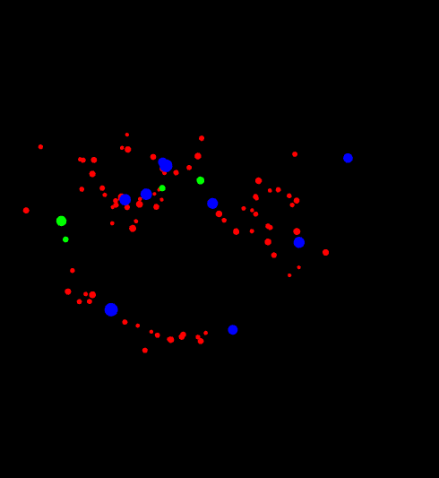
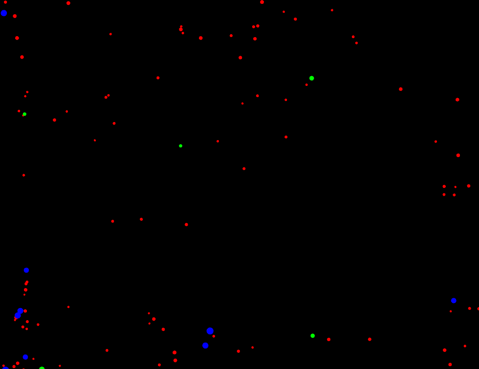

# ACTIVIDAD 1:

## Describe con tus propias palabras el comportamiento general de la aplicación. ¿Qué ves en pantalla?
En la aplicación hay diversas partículas que se mueven alrededor del recuadro. 

## ¿Cómo puedes interactuar con la aplicación? Menciona específicamente las teclas y qué efecto parecen tener sobre las partículas.
Se puede interactuar a través de las teclas ‘a’, ‘r’, ‘s’, ‘n’ donde ‘a’ abstrae las partículas, ‘r’ hace como una expansión, ‘s’ detiene el tiempo y ‘n’ cambia la trayectoria.

## ¿Observas diferentes tipos de “partículas” (elementos visuales)? ¿Se comportan todas igual inicialmente?
Hay diferentes colores pero todas se comportan igual.

## Toma algunas capturas de pantalla de la aplicación en diferentes momentos (estado inicial, después de presionar ‘a’, ‘r’, ‘s’, ‘n’) y añádelas a tu bitácora.

## ¿Qué crees que está pasando “detrás de cámaras” cuando presionas las teclas? Formula una hipótesis inicial sobre cómo la aplicación cambia el comportamiento de las partículas.
Cuando el usuario presiona una tecla, la aplicación emite un evento a través de alguna estructura y cada partícula reacciona cambiando su estado interno, lo que modifica su comportamiento de movimiento en la aplicación.
