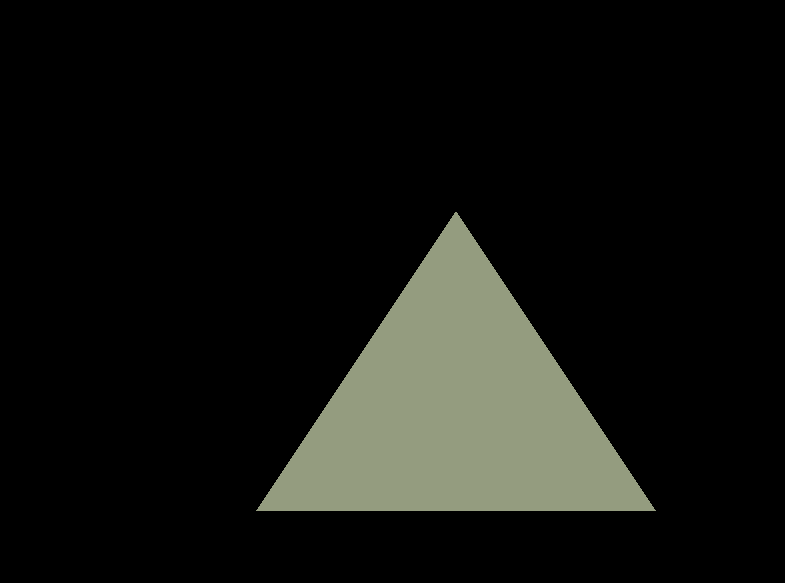

# ACTIVIDAD 5: 
1. Normalización de las coordenadas del mouse:
* Coordenadas de la ventana: El mouse da coordenadas en píxeles, con el origen en la esquina superior izquierda de la ventana.
* Normalización: Las coordenadas del mouse se transforman a un rango [0, 1] dividiendo las coordenadas por el tamaño de la ventana (SCR_WIDTH y SCR_HEIGHT).
* Ajuste del eje Y: En OpenGL, el eje y crece hacia arriba, por lo que invertimos la coordenada y restando el valor de y a 1.
* Resultado: Obtenemos valores normalizados para x y y en el rango [0, 1], donde (0, 0) es la esquina inferior izquierda y (1, 1) la esquina superior derecha.
2. Normalización a Coordenadas de Dispositivo Normalizadas (NDC):
* NDC en OpenGL: OpenGL usa un sistema de coordenadas en el que los valores se mapean en el rango [-1, 1] para ambos ejes.
* Conversión: Convertimos las coordenadas normalizadas [0, 1] a NDC con la fórmula:
* Resultado: Obtenemos las coordenadas NDC, que OpenGL usa para determinar la posición de los vértices en la pantalla.
3. Relación con el sistema de coordenadas de OpenGL:
* Espacio NDC: OpenGL usa NDC para todos los vértices antes de que se proyecten en la pantalla. Las coordenadas NDC van de [-1, 1] para ambos ejes.
* Triángulo interactivo: Las coordenadas del mouse se normalizan a NDC, lo que permite mover el triángulo en la pantalla según el mouse.

``` cpp
#include <glad/glad.h>
#include <GLFW/glfw3.h>
#include <iostream>

// Tamaño de ventana
const unsigned int SCR_WIDTH = 800;
const unsigned int SCR_HEIGHT = 600;

// Shaders como texto
const char* vertexShaderSource = R"glsl(
    #version 460 core
    layout(location = 0) in vec3 aPos;
    uniform vec2 offset;

    void main() {
        vec3 newPos = aPos;
        newPos.x += offset.x;
        newPos.y += offset.y;
        gl_Position = vec4(newPos, 1.0);
    }
)glsl";

const char* fragmentShaderSource = R"glsl(
    #version 460 core
    out vec4 FragColor;
    uniform vec4 ourColor;

    void main() {
        FragColor = ourColor;
    }
)glsl";

// Función para compilar shaders y crear el programa
GLuint createShaderProgram() {
    GLuint vertexShader = glCreateShader(GL_VERTEX_SHADER);
    glShaderSource(vertexShader, 1, &vertexShaderSource, nullptr);
    glCompileShader(vertexShader);

    GLuint fragmentShader = glCreateShader(GL_FRAGMENT_SHADER);
    glShaderSource(fragmentShader, 1, &fragmentShaderSource, nullptr);
    glCompileShader(fragmentShader);

    GLuint shaderProg = glCreateProgram();
    glAttachShader(shaderProg, vertexShader);
    glAttachShader(shaderProg, fragmentShader);
    glLinkProgram(shaderProg);

    glDeleteShader(vertexShader);
    glDeleteShader(fragmentShader);

    return shaderProg;
}

int main() {
    glfwInit();
    glfwWindowHint(GLFW_CONTEXT_VERSION_MAJOR, 4);
    glfwWindowHint(GLFW_CONTEXT_VERSION_MINOR, 6);
    glfwWindowHint(GLFW_OPENGL_PROFILE, GLFW_OPENGL_CORE_PROFILE);

    GLFWwindow* window = glfwCreateWindow(SCR_WIDTH, SCR_HEIGHT, "Triángulo Interactivo", nullptr, nullptr);
    glfwMakeContextCurrent(window);
    gladLoadGLLoader((GLADloadproc)glfwGetProcAddress);

    // Datos del triángulo
    float vertices[] = {
         0.0f,  0.5f, 0.0f,
        -0.5f, -0.5f, 0.0f,
         0.5f, -0.5f, 0.0f
    };

    GLuint VAO, VBO;
    glGenVertexArrays(1, &VAO);
    glGenBuffers(1, &VBO);

    glBindVertexArray(VAO);
    glBindBuffer(GL_ARRAY_BUFFER, VBO);
    glBufferData(GL_ARRAY_BUFFER, sizeof(vertices), vertices, GL_STATIC_DRAW);
    glVertexAttribPointer(0, 3, GL_FLOAT, GL_FALSE, 3 * sizeof(float), (void*)0);
    glEnableVertexAttribArray(0);

    GLuint shaderProg = createShaderProgram();
    glUseProgram(shaderProg);

    GLint offsetLoc = glGetUniformLocation(shaderProg, "offset");
    GLint colorLoc = glGetUniformLocation(shaderProg, "ourColor");

    while (!glfwWindowShouldClose(window)) {
        glClear(GL_COLOR_BUFFER_BIT);

        // Obtener posición del mouse
        double xpos, ypos;
        glfwGetCursorPos(window, &xpos, &ypos);

        float x = (float)xpos / SCR_WIDTH;
        float y = (float)ypos / SCR_HEIGHT;

        if (x < 0) x = 0; if (x > 1) x = 1;
        if (y < 0) y = 0; if (y > 1) y = 1;

        float ndcX = x * 2.0f - 1.0f;
        float ndcY = 1.0f - y * 2.0f;

        // Actualizar uniforms
        glUniform2f(offsetLoc, ndcX, ndcY);
        glUniform4f(colorLoc, x, y, 0.5f, 1.0f);

        // Dibujar
        glBindVertexArray(VAO);
        glDrawArrays(GL_TRIANGLES, 0, 3);

        glfwSwapBuffers(window);
        glfwPollEvents();
    }

    glDeleteProgram(shaderProg);
    glDeleteVertexArrays(1, &VAO);
    glDeleteBuffers(1, &VBO);
    glfwTerminate();
    return 0;
}
```
