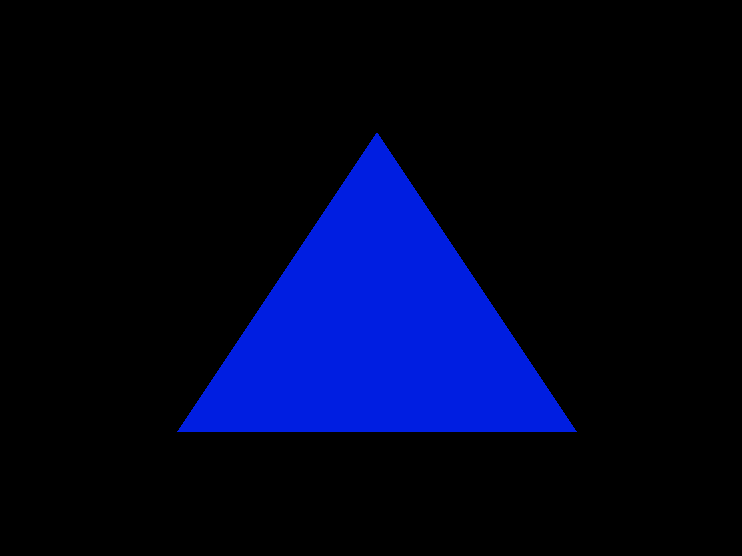

``` cpp
#include <glad/glad.h>
#include <GLFW/glfw3.h>
#include <iostream>

// Tamaño de ventana
const unsigned int SCR_WIDTH = 800;
const unsigned int SCR_HEIGHT = 600;

// Shaders como texto
const char* vertexShaderSource = R"glsl(
    #version 460 core
    layout(location = 0) in vec3 aPos;

    void main() {
        gl_Position = vec4(aPos, 1.0);
    }
)glsl";

const char* fragmentShaderSource = R"glsl(
    #version 460 core
    out vec4 FragColor;
    uniform float time;

    void main() {
        float green = (sin(time) + 1.0) / 2.0;
        FragColor = vec4(0.0, green, 1.0 - green, 1.0);
    }
)glsl";

// Función para compilar shaders y crear el programa
GLuint createShaderProgram() {
    GLuint vertexShader = glCreateShader(GL_VERTEX_SHADER);
    glShaderSource(vertexShader, 1, &vertexShaderSource, nullptr);
    glCompileShader(vertexShader);

    GLuint fragmentShader = glCreateShader(GL_FRAGMENT_SHADER);
    glShaderSource(fragmentShader, 1, &fragmentShaderSource, nullptr);
    glCompileShader(fragmentShader);

    GLuint shaderProg = glCreateProgram();
    glAttachShader(shaderProg, vertexShader);
    glAttachShader(shaderProg, fragmentShader);
    glLinkProgram(shaderProg);

    glDeleteShader(vertexShader);
    glDeleteShader(fragmentShader);

    return shaderProg;
}

int main() {
    glfwInit();
    glfwWindowHint(GLFW_CONTEXT_VERSION_MAJOR, 4);
    glfwWindowHint(GLFW_CONTEXT_VERSION_MINOR, 6);
    glfwWindowHint(GLFW_OPENGL_PROFILE, GLFW_OPENGL_CORE_PROFILE);

    GLFWwindow* window = glfwCreateWindow(SCR_WIDTH, SCR_HEIGHT, "Triángulo con Color Dinámico", nullptr, nullptr);
    glfwMakeContextCurrent(window);
    gladLoadGLLoader((GLADloadproc)glfwGetProcAddress);

    float vertices[] = {
         0.0f,  0.5f, 0.0f,
        -0.5f, -0.5f, 0.0f,
         0.5f, -0.5f, 0.0f
    };

    GLuint VAO, VBO;
    glGenVertexArrays(1, &VAO);
    glGenBuffers(1, &VBO);

    glBindVertexArray(VAO);
    glBindBuffer(GL_ARRAY_BUFFER, VBO);
    glBufferData(GL_ARRAY_BUFFER, sizeof(vertices), vertices, GL_STATIC_DRAW);
    glVertexAttribPointer(0, 3, GL_FLOAT, GL_FALSE, 3 * sizeof(float), (void*)0);
    glEnableVertexAttribArray(0);

    GLuint shaderProg = createShaderProgram();
    glUseProgram(shaderProg);

    GLint timeLoc = glGetUniformLocation(shaderProg, "time");

    while (!glfwWindowShouldClose(window)) {
        glClear(GL_COLOR_BUFFER_BIT);

        float timeValue = glfwGetTime();
        glUniform1f(timeLoc, timeValue);

        glBindVertexArray(VAO);
        glDrawArrays(GL_TRIANGLES, 0, 3);

        glfwSwapBuffers(window);
        glfwPollEvents();
    }

    glDeleteProgram(shaderProg);
    glDeleteVertexArrays(1, &VAO);
    glDeleteBuffers(1, &VBO);
    glfwTerminate();
    return 0;
}
```
## Cambios realizados en el código C++
* Obtención del tiempo: Usé la función glfwGetTime() dentro del loop principal para obtener el tiempo en segundos desde que se inició GLFW.
* Uniform actualizado: Definí un uniform float time; en el fragment shader, y en C++ usé glGetUniformLocation(shaderProg, "time") para obtener su ubicación. Luego, lo actualicé en cada frame con glUniform1f(timeLoc, timeValue);.
## Explicación de la función de tiempo
* Utilicé sin(time) para generar una onda senoidal que varía suavemente en el tiempo.
* Luego la normalicé a un rango de 0.0 a 1.0 con la fórmula (sin(time) + 1.0) / 2.0.
* Este valor se usa como componente verde del color, mientras que el componente azul es el inverso (1.0 - green). Esto crea una transición suave entre azul y verde a lo largo del tiempo.
## Reflexión
* Rotación del triángulo usando una matriz de transformación que cambia con sin(time) o cos(time).
* Tamaño pulsante, escalando los vértices con una función tipo (sin(time) + 1.0).
* Ondas de color o brillo que se propagan en patrones circulares o radiales.
* Parpadeo o fade in/fade out para efectos de aparición o desaparición.
